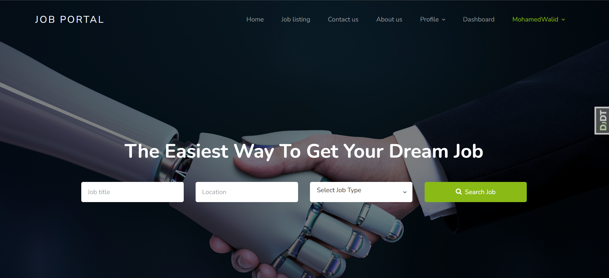

# 🖥️ Web Job Application Analyzer
## Revolutionizing recruitment with AI, NLP, and Machine Learning magic.

#### web-based platform that transforms the recruitment process using the power of Natural Language Processing, Machine Learning, and Speech-to-Text technologies. Our tool automates interview transcription, extracts meaningful insights, summarizes key points, and even recommends top candidates—all in one elegant, recruiter-friendly dashboard.


# ✨  A web platform that (Features): 
- 📹 Live interview streaming and recording
- 🧠 Automatic transcription with OpenAI Whisper
- 🧩 Resume parsing and candidate profiling
- 🎯 Smart candidate recommendation engine
- 🔒 Secure, scalable Django-based web platform

# 🤖 AI-Powered Interview Question Generation
Our platform uses cutting-edge AI to generate personalized interview questions tailored to each job posting:

## How it Works
- 🔍 Analyzes job descriptions to identify key skills and requirements
- 📝 Generates both general and skill-specific questions automatically
- 🎯 Creates technical and behavioral questions to assess candidates comprehensively
- 🔄 Integrates directly into the application process

## Key Features
- ✅ Automatic generation of interview questions from job descriptions
- ✅ Skill-specific questions that target exact requirements
- ✅ Consistent question quality across all interviews
- ✅ Questions stored and reused for all applicants to ensure fair comparison
- ✅ Real-time video responses with automatic transcription
- ✅ Employer dashboard to review and compare candidate answers

## Benefits
- 💯 Eliminates recruiter bias in question creation
- ⏱️ Saves hours of interview preparation time
- 🔍 Ensures all critical skills are properly assessed
- 📊 Enables direct comparison between candidates
- 🧠 Leverages Google's Gemini AI for natural-sounding questions

## 📸 Screenshots



# How to Run (Local Dev)

## Clone the repo
```bash
git clone https://github.com/MOHAAAMEEEEED/web_recruitment.git
cd web_recruitment
```

## Set up your virtual environment
```bash
python -m venv venv
source venv/bin/activate  # or venv\Scripts\activate on Windows
```

## Install dependencies
```bash
pip install -r requirements.txt
```

## Run the Django server
```bash
python manage.py runserver
```